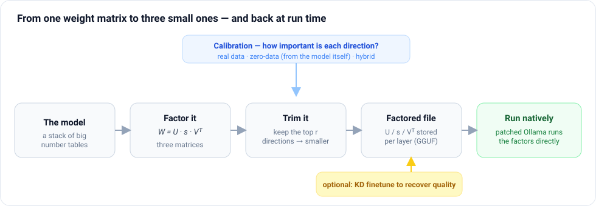
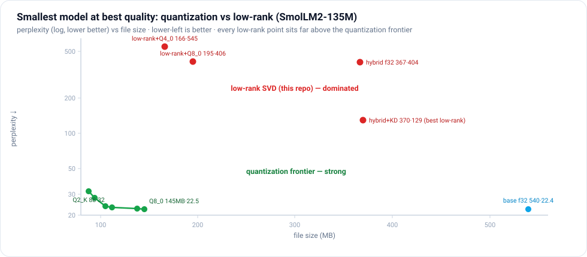
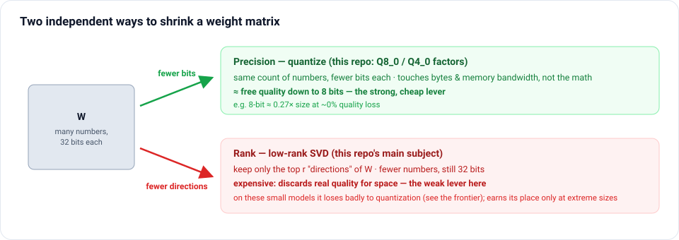
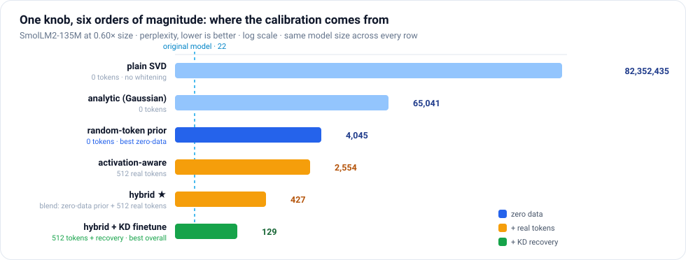
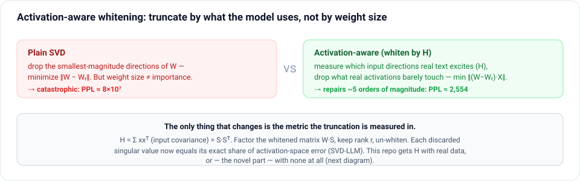
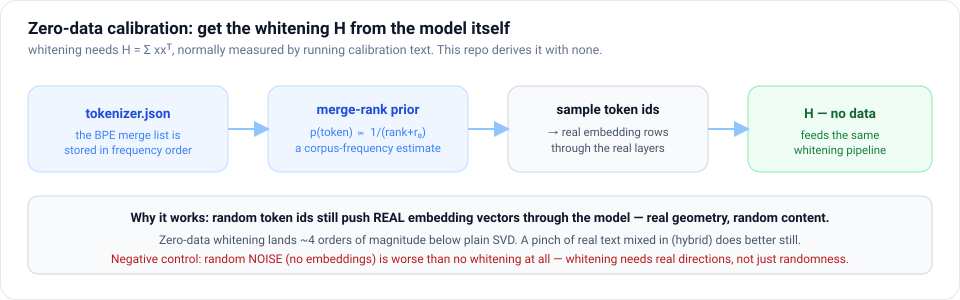
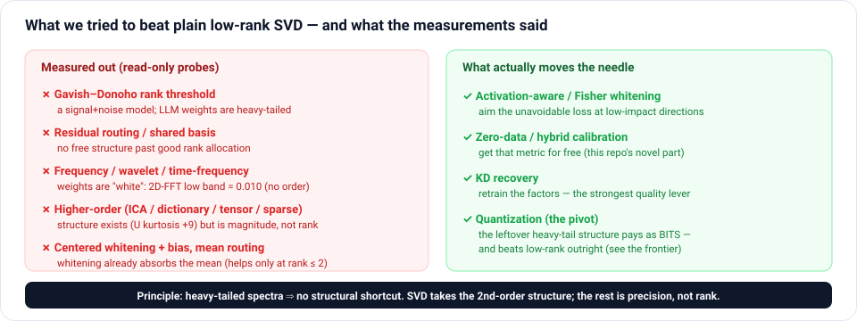

# distill-rank

**A research log on making LLM weights smaller. It builds a low-rank SVD
compression pipeline that runs natively as factors inside Ollama/llama.cpp, and
contributes a genuinely new *zero-data* calibration method. It also reports,
honestly, the punchline for the goal "smallest model at best quality": plain
quantization beats low-rank outright on these models. The negative results are
part of the point — this is a map of what works, what doesn't, and why.**

<p align="center">
  
</p>

> **In one sentence:** an LLM is millions of numbers arranged in big grids called
> **matrices**; this project rewrites each matrix as a smaller stand-in, keeps only
> the parts that matter for real text, and runs the result — smaller and, after a
> performance fix, *faster* than the original. The new idea is choosing what
> matters without any example text to learn from.

---

## The honest headline: quantization wins

The goal is the **smallest file at the best quality.** Measured on one model
(SmolLM2-135M) against the strong baseline — quantizing the *dense* weights, no
SVD at all:

<p align="center">
  
</p>

| dense quantization (no SVD) | size MB | PPL↓ |
|---|---|---|
| base f32 (uncompressed) | 540 | 22.4 |
| **Q8_0** | **145** | **22.5** |
| Q6_K | 138 | 22.8 |
| Q5_K_M | 112 | 23.2 |
| Q4_K_M | 105 | 23.8 |
| Q3_K_M | 94 | 28.1 |
| Q2_K | 88 | 32.0 |

The quantization frontier (green) dominates: 8-bit is 145 MB at essentially base
quality (22.5 vs 22.4), degrading gracefully to 88 MB at PPL 32. Every low-rank
point (red) — even the best, hybrid + KD at PPL 129 — sits far above it: larger
*and* worse. **For models this size, low-rank SVD is the wrong primary tool for
weight compression; quantization is the right one.** We report that plainly rather
than bury it.

<p align="center">
  
</p>

Two orthogonal axes shrink a weight — **precision** (bits per number) and **rank**
(how many numbers). This repo is mostly about the *rank* axis; the honest finding
is that *precision* is the strong axis, and the two only combine usefully at
extreme sizes (below the ~88 MB quantization floor), where quality is already poor.

### So what is worth keeping here

Three things survive that verdict and stand on their own:

1. **A genuinely new zero-data / hybrid calibration** — compress low-rank *well*
   with no calibration text, by reading the statistics out of the model's own
   tokenizer. Useful wherever low-rank factors are the right representation
   (adapters, delta weights, KV cache), independent of the verdict for full weights.
2. **A native factored-execution runtime** — factors run inside stock Ollama, and
   *quantized* factors decode faster than the dense base.
3. **A thorough, measured map of what does and doesn't work** — six probed dead
   ends and the one principle that explains them all.

The rest is the research log behind those three.

## The low-rank results (for the record)

The pipeline does real low-rank compression, and how far *calibration* moves
quality at a fixed low-rank budget is the interesting research question. Same
model, same 0.60× rank budget — only *how we pick what to keep* changes:

<p align="center">
  
</p>

**At 0.60× rank budget:** plain data-free SVD ≈ 8×10⁷ → zero-data whitening 4,045 →
hybrid (512 calibration tokens) 427 → hybrid + 200 KD steps **129**. Six orders of
magnitude from calibration alone — a real, interesting result about *calibration* —
but, per the frontier above, still short of dense 8-bit's 22.5 at a larger size.

All variants below exported with aligned ranks at global budget 0.6× via one
harness (`scripts/benchmark.py`, sequential runs). PPL on wikitext (ctx 256);
HellaSwag/Winogrande over 400 tasks; prefill/decode via `llama-bench` (pp/tg
128), 24-thread CPU. **GFLOPs/tok** is the exact per-token matmul cost, read off
the GGUF tensor shapes (block projections + the tied LM head, dense or
`U·s·Vᵀ`); the context-dependent attention-score term is excluded because it is
identical across variants. It measures the *compute* cut, next to `size MB`'s
*memory* cut.

**SmolLM2-135M** (f32, 540 MB → ~370 MB):

| variant | calib | size MB | GFLOPs/tok↓ | PPL↓ | HellaSwag↑ | Winogrande↑ | prefill t/s | decode t/s |
|---|---|---|---|---|---|---|---|---|
| **base (uncompressed)** | — | 539.8 | **0.269** | **22.4** | **41.2** | **55.2** | 1,652 | 67.7 |
| plain SVD | 0 | 370.7 | 0.184 | 82,352,435 | 25.8 | 48.5 | 1,722 | 58.9 |
| analytic MC | 0 | 369.8 | 0.184 | 65,041 | 26.2 | 47.5 | 1,743 | 64.0 |
| random-token prior | 0 | 373.8 | 0.186 | 4,045 | 24.0 | 47.8 | **1,784** | 65.8 |
| data 2-seq | 512 | 369.0 | 0.183 | 2,554 | 27.8 | 49.0 | 1,714 | 61.7 |
| data 24-seq | 12k | 369.1 | 0.184 | 9,002 | 26.5 | 49.0 | 1,662 | 63.6 |
| hybrid | 512 | 370.6 | 0.184 | 427 | 27.0 | 51.5 | 1,707 | 65.7 |
| **hybrid + KD** | 512+KD | 370.6 | 0.184 | **129** | 28.5 | 51.8 | 1,752 | **70.4** |
| input-only (data 8-seq) | 4k | 369.6 | 0.184 | 3,672 | 25.2 | 46.8 | 1,634 | 61.2 |
| **data IO-SVD (2-sided)** | 4k | 369.6 | 0.184 | **1,356** | 23.5 | 50.2 | 1,624 | 61.9 |
| **zero-data IO-SVD** | 0 | 373.8 | 0.186 | **1,888** | 25.2 | 47.0 | 1,684 | 64.3 |
| **hybrid + prior-Fisher** | 512 | 370.6 | 0.184 | **419** | 27.0 | **54.2** | 1,649 | 64.1 |

The last four rows are the two-sided arms (compare `input-only 8-seq` ↔
`data IO-SVD` for the data effect, `random-token prior` ↔ `zero-data IO-SVD` for
the zero-data effect). Two-sided roughly halves PPL vs its input-only pair at
equal size and speed, and **hybrid + prior-Fisher (419) edges past hybrid (427)
with the best compressed-model Winogrande (54.2, vs base 55.2)** — the only place
task accuracy visibly separates without KD. Otherwise, at this 0.6× budget
HellaSwag/Winogrande hover near chance for compressed variants (base 41/55 →
~24-28 / ~47-54), so PPL is the discriminating metric here; accuracy separates
cleanly only with KD recovery (or a gentler budget). (The pure-data rows are
noisy — *24* seqs scoring worse than *2* is small-sample rank-allocation
variance, exactly what the hybrid's shrinkage prior repairs.)

**Qwen2.5-0.5B** (f32, 1,982 MB → ~1,410 MB):

| variant | calib | size MB | GFLOPs/tok↓ | PPL↓ | HellaSwag↑ | Winogrande↑ | prefill t/s | decode t/s |
|---|---|---|---|---|---|---|---|---|
| **base (uncompressed)** | — | 1,982 | **0.988** | **19.0** | **51.0** | **57.0** | 669 | 25.3 |
| random-token prior | 0 | 1,409 | 0.701 | 741 | 26.8 | 50.0 | 867 | 31.0 |
| **zero-data IO-SVD** | 0 | 1,409 | 0.701 | **651** | 27.5 | 53.5 | 916 | 31.9 |
| data 2-seq | 512 | 1,418 | 0.706 | 836 | 27.2 | **56.0** | 887 | 30.9 |
| **data IO-SVD (2-sided)** | 4k | 1,421 | 0.707 | **530** | 25.0 | 51.5 | 885 | 31.6 |
| **hybrid** | 512 | 1,405 | 0.699 | **213** | 26.5 | 49.5 | 908 | 31.8 |

On Qwen the two-sided arms again beat their input-only pairs: zero-data IO-SVD
651 < random-token 741 (and higher HellaSwag/Winogrande), data IO-SVD 530 <
data-2seq 836. Hybrid input-only (213) remains best here — a Qwen hybrid+Fisher
arm is the obvious next run.

**Reading the tradeoff:**

- **Size & compute**: a clean ~28–32% cut in *both* file size and per-token
  matmul FLOPs at budget 0.6×, identical across calibration methods — the rank
  plan sets size and compute together; calibration sets the *quality* at that
  point. Both land above the 0.60× budget (0.68× SmolLM2, 0.71× Qwen) for the
  same reason: the tied LM head is left unfactorized, a shared fixed floor in
  bytes and in FLOPs.
- **Speed** (post-alignment): the zero-data and hybrid arms beat dense at prefill
  (+4–8% on SmolLM2, **+30–37% on Qwen**), and *every* factored arm beats dense at
  decode on Qwen (+22–26%). On SmolLM2 the two-sided arms sit within ~2% of dense
  at prefill, and hybrid+KD is the one variant that also beats dense at decode
  (70.4 vs 67.7 t/s). Raw CSVs: `runs/benchmark-{smol,qwen}.csv`.
- **Quality**: calibration choice spans six orders of magnitude of PPL at
  identical size; KD recovery is decisive (hybrid+KD is the only variant within
  ~6× of base PPL and recovers HellaSwag toward base).
- **Precision**: the f32 factors above can be quantized to 8-bit for another ~2×
  size cut and **+46–65% CPU decode** at ~free quality — a second, orthogonal axis;
  see [Factor quantization](#factor-quantization-the-rank--precision-axis).

---

## In plain terms — what's actually going on

*(Skip to [Original contributions](#original-contributions) if you want the
research framing straight away.)*

### The problem

A large language model is, under the hood, a long stack of **big grids of
numbers** — the "weights." Mathematicians call each grid a **matrix** (think of a
spreadsheet), and that is the word used throughout this README. Running the model
means multiplying your text (turned into vectors) by these matrices, over and
over. The matrices are what take up disk space and memory, and multiplying by
them is most of the compute.

The goal of this project: **make the matrices smaller** — so the model needs less
disk and memory and runs faster — **without making it noticeably dumber.**

### What SVD does (the photo-compression analogy)

There's a classic piece of math, the **Singular Value Decomposition (SVD)**, that
rewrites any one matrix `W` as a product of three thinner ones:

```
    W   ≈   U  ·  s  ·  Vᵀ
 (big)     (tall)(few)(wide)
```

You can think of it like **JPEG for a matrix**: it sorts the matrix's content into
"patterns," ordered from most to least important. If you keep only the top `r`
patterns and throw away the long tail, you store three small matrices instead of
one big one. Keep `r` small enough and the three thin matrices together hold *far
fewer numbers* than the original — that's the compression. ("Low-rank" just means
"we kept only the top `r` patterns.")

**A concrete example.** One attention weight in these models is a 1536×1536 matrix
= **2.36 million numbers**. Keep the top 205 patterns and you store
205 × (1536 + 1536) ≈ **0.63 million numbers** — about **27%** of the original —
and the model still writes coherent text.

### The hard part: *which* patterns to keep

SVD orders patterns by a purely mathematical notion of "size." But the biggest
patterns *on paper* aren't always the ones that matter *for real sentences*. Drop
the wrong ones and quality falls off a cliff (that's the `82,352,435` row in the
chart above — plain SVD with no guidance).

The fix the field uses is **calibration**: feed the model some example text,
watch which directions actually light up, and protect those. This is called
**activation-aware whitening**. It works well — but it needs representative
calibration text, which you don't always have (private data, licensing, a new
domain with no corpus).

### The contribution, in one line

**We compute "which patterns matter" from the model's own weights and its
tokenizer — with zero example text.** And a **hybrid** approach — take that
zero-data self-estimate and blend it with a *tiny* real-text sample (a few
hundred tokens) — beats using lots of text, because the steady self-estimate
cancels the noise in the small sample. So "hybrid" throughout this README means
exactly that: *the model's self-estimate averaged with a little real data.* On
top of that, the compressed model doesn't just live in a Python simulation: a
small patch makes **Ollama run the three-matrix form natively**, and after a
performance fix it runs *faster* than the uncompressed model.

The bar chart above tells the whole story: as you move from "no idea what
matters" (plain SVD) to "read it from the model itself" (random-token / analytic)
to "a pinch of real data mixed in" (hybrid) to "then briefly retrain" (KD), the
same-sized model gets dramatically better.

### The vocabulary, decoded

| term you'll see below | what it means in plain words |
|---|---|
| **weight matrix `W`** | one of the model's big number grids |
| **rank `r`** | how many "patterns" we keep; smaller = more compression |
| **whitening / `H`** | the map of which input directions matter, learned from data |
| **calibration** | the text (or, here, the *no text*) used to build that map |
| **zero-data / analytic** | building that map from the model + tokenizer alone |
| **hybrid** | the zero-data estimate blended with a little real text |
| **KD (knowledge distillation)** | briefly retrain the small model to imitate the big one |
| **perplexity (PPL)** | how "surprised" the model is by real text; **lower is better** |
| **prefill / decode tok/s** | speed reading the prompt / speed writing the answer |

---

## Contents

- [Original contributions](#original-contributions)
- [Background and related work](#background-and-related-work)
- [The factored-execution runtime](#the-factored-execution-runtime)
- [The compression pipeline](#the-compression-pipeline)
- [Zero-data analytic whitening](#zero-data-analytic-whitening)
- [Influence-aware two-sided whitening](#influence-aware-two-sided-whitening-data--zero-data)
- [Performance engineering: the rank-alignment bug](#performance-engineering-the-rank-alignment-bug)
- [What we ruled out (the exploration)](#what-we-ruled-out-the-exploration)
- [Factor quantization (the rank × precision axis)](#factor-quantization-the-rank--precision-axis)
- [Repository layout](#repository-layout)
- [Reproducing everything](#reproducing-everything)
- [Limitations](#limitations)
- [References](#references)

---

## Original contributions

Novelty claims below were checked against the literature by web search on
2026-07-02/03; "no prior art found" means exactly that — a diligent search
found nothing, not a guarantee of absolute priority. Closest adjacent work is
cited inline so the reader can judge.

1. **Zero-data whitening covariance from tokenizer statistics.** Activation-aware
   SVD compression [1–3] needs the per-layer input covariance `H = Σ xxᵀ`,
   universally measured by forwarding calibration text. We compute usable `H`
   with **no data**: sample token ids i.i.d. from a *merge-rank prior* — BPE
   merges are stored in training-corpus frequency order [14], so
   `p(token) ∝ 1/(merge_rank + r₀)` is a corpus frequency estimate read straight
   out of `tokenizer.json`. Closest prior art: Self-Calibration [12] has the
   model *generate* its own calibration data for quantization/pruning (needs
   generation passes; a different mechanism), and random-token calibration has
   been observed to work for quantization [11]. Applying either to SVD whitening,
   and the merge-rank frequency prior itself, appear to be new. Verified here:
   the prior ordering merge_rank > zipf > uniform holds on the *exact* (assumption-free)
   layer-0 covariance, and zero-data whitening lands ~4 orders of magnitude
   below plain data-free SVD end to end.

2. **Hybrid shrinkage calibration — the analytic covariance as a prior.**
   `H = λ·Ĥ_analytic + (1−λ)·H_data(k)` with per-layer trace matching, in the
   spirit of Ledoit–Wolf covariance shrinkage [15]. Adding the analytic prior to
   a **512-token** sample cuts perplexity from 2,554 (pure 512-token whitening) to
   **427** — ~6× — at identical model size, and beats every larger pure-data run
   in our benchmark (up to 12k tokens). The prior is worth roughly **8× the data**
   (256 tokens + prior beats 2,048 tokens of pure data; see the sweep below),
   because small-sample covariances in 1,536 dimensions are noise-dominated and
   the analytic prior regularizes exactly the directions the sample cannot
   estimate. No prior art found for shrinkage-regularized whitening in LLM
   compression.

3. **Analytic moment propagation (and an instructive negative result).** A fully
   data-free estimator that propagates the residual stream's Gaussian moments
   `(μ_l, Σ_l)` layer by layer — sampling from the analytic Gaussian and pushing
   the samples through the *real* decoder layers, re-fitting moments after each
   layer. It works (65k PPL vs 8×10⁷ plain) but is ~16× *worse* than simply
   sampling random token ids: **moment-matched Gaussianization destroys the
   heavy-tailed activation structure that FFN whitening depends on.** A companion
   experiment shows pure random *noise* does worse than no whitening at all —
   whitening needs covariance *directions*, which only real embeddings provide.
   No prior art found for either the method or the finding.

4. **The factored-execution runtime.** Compression papers simulate low-rank
   inference in PyTorch and report parameter counts; here the factors are the
   *deployed representation*: a 5-file / ~108-line llama.cpp patch loads
   `U/s/Vᵀ` at three universal seams and executes them for any dense or MoE
   architecture, inside stock Ollama serving. Verified token-for-token against
   dense baselines on three architectures.

5. **The rank-alignment performance cliff.** Factored models measured *slower*
   than dense despite 0.59× FLOPs — because ggml's fast f32 GEMM
   (`llamafile_sgemm`) rejects any matmul whose inner dimension `k % 8 ≠ 0`, and
   in a factored model the second matmul's inner dimension *is the kept rank*.
   Energy-threshold ranks are arbitrary integers, so nearly every layer fell
   onto the slow generic path. Rounding ranks up to a multiple of 8 (<2% size,
   strictly more spectrum) flips factored models to **faster than dense at both
   prefill and decode**. We found no published discussion of SIMD-alignment
   constraints in rank selection for low-rank LLM inference.

6. **Zero-data Fisher-weighted (two-sided) whitening.** Two-sided whitening —
   truncating in both an input-activation and an output-loss-gradient metric — is
   published (IO-SVD [21], GFWSVD [22]) and needs calibration text for *both*
   sides; this repo implements it as an attributed baseline. The new part is
   obtaining the output-side Fisher signal with **zero data**, from the LM-loss
   gradients of merge-rank-prior-sampled tokens (extending contribution 1). It
   beats zero-data input-only whitening by 53% and even beats *data-based*
   input-only whitening at equal size. We also document that two-sided whitening
   must **skip q/k** (their softmax-attention output path breaks the Fisher
   linearization — measured ~2.7× worse), which we did not find noted elsewhere.

## Background and related work

**Activation-aware low-rank compression.** Plain truncated SVD minimizes
`‖W − W_r‖`, which is the wrong objective — what matters is the error on real
activations, `‖(W − W_r)X‖`. ASVD [1] first scaled weights by activation
statistics; SVD-LLM [2] made the mapping exact by whitening: with
`H = Σ xxᵀ = SSᵀ` (Cholesky), truncate the SVD of `W·S` and de-whiten, so each
discarded singular value contributes exactly its share of activation-space
error. SVD-LLM V2 [3], Swift-SVD [7], Dobi-SVD [6] and others refine the
truncation, rank selection, or efficiency. All of them consume calibration
text. AIR [8] reduces the calibration data requirement (~90% less); PARSE [9]
selects ranks per prompt; Basis Sharing [10] shares singular bases across
layers. Sparse-plus-low-rank and quantization-plus-low-rank hybrids (SLiM [4],
HASSLE-free [17], 3BASiL [18], CALDERA-style low-precision factorization)
combine decompositions. Mixed precision along the singular spectrum exists for
delta weights and adapters (Delta-compression QEM [5], LoRAQuant [19],
SVDq [20]). This repo implements the standard lineage ([1,2] plus budget
allocation and KD recovery) as its baseline; the zero-data and shrinkage
calibration described below are, to our knowledge, not in this literature.

**Data-free calibration elsewhere.** LLM-QAT [11] pioneered data-free
quantization-aware training with model-generated data; Self-Calibration [12]
does the same for PTQ/pruning. Both *generate* data with the model. The
merge-rank prior here needs no generation — the tokenizer already encodes
corpus statistics [13,14].

## The factored-execution runtime

Every linear weight `W` (`[out, in]`, or `[n_expert, out, in]` for MoE expert
stacks) is replaced by three tensors from its thin SVD:

```
W = U · diag(s) · Vᵀ        U:[out, r]   s:[r]   Vᵀ:[r, in]   r = min(out, in)
```

At full rank this is loss-less — the model is simply **stored, and executed, as
three matrices per linear instead of one**. Truncating `r` (the compression step
below) turns it into genuine compression: `r(out+in) < out·in` parameters and FLOPs.

### Architecture-agnostic by construction

There is **no per-model code**. The factorization is wired into the three
universal seams every architecture in llama.cpp shares
(`patches/svd-generic.patch`, 5 files, ~108 lines):

| seam (patched) | role |
|----------------|------|
| `llama_model_base::create_tensor` | load hook: if a fused `…weight` is absent but `…svd_vt` exists, load `U/s/Vᵀ`, register them in a model-level map, return a handle tensor |
| `build_lora_mm` | every **dense** linear: if the weight is a handle, emit `U·(s⊙(Vᵀx))` instead of one `mul_mat` |
| `build_lora_mm_id` | every **MoE expert** matmul: same, with per-expert singular values gathered by routing ids |

A `const llama_svd_map* svd` is threaded through `llm_graph_params` /
`llm_graph_context` exactly like LoRA adapters. The GGUF keeps its real
`general.architecture`, so Ollama routes, sizes and loads it normally. Ollama
serves all GGML models through upstream `llama-server`, so the patch is applied
to llama.cpp `b9509` (after Ollama's own compat patches) and Ollama v0.30.5 is
rebuilt against it (`OLLAMA_LLAMA_CPP_SOURCE`).

### ggml mapping

`llama-server` stores linear weights transposed (`ne = {in, out}`) and applies
`weight.mul_mat(x)`. The factors are stored to match — `Vᵀ {in, r}`, `s {r}`,
`U {r, out}` — and the runtime emits `mul_mat(U, mul(mul_mat(Vᵀ, x), s))`. For
MoE, `s` is `{r, n_expert}`, gathered per routed expert with
`ggml_get_rows(s, ids)`. HF→GGUF q/k RoPE row permutation is applied to the
`U` factor at export.

### Verified

Greedy decoding (`temperature 0`, `top_k 1`) of the factorized model matches the
plain f32 baseline **token-for-token**:

| model | arch | linears factorized | recon. error | parity |
|-------|------|--------------------|--------------|--------|
| Qwen2.5-0.5B | `qwen2` (dense) | 168 | ~1e-6 | ✅ |
| SmolLM2-135M | `llama` (dense) | 210 | ~7e-6 | ✅ |
| tiny Qwen2-MoE | `qwen2moe` (MoE) | 21 | ~4e-8 | ✅ |

The factorized GGUF contains **no** fused `…attn_q.weight` — only
`…svd_u/s/vt` — so stock llama.cpp cannot load it; a token match proves the
factored path actually ran. Coverage: every architecture whose linears flow
through `build_lora_mm`/`build_lora_mm_id` (llama, qwen2/3, gemma, phi,
mistral, mixtral, qwen3-moe, …); MLA `attn_*_a/_b` and SSM/conv weights are
deliberately skipped (not plain linear projections).

## The compression pipeline

`distillrank/` is a config-driven pipeline: **calibrate → factorize
[activation-aware] [+ finetune] → export GGUF → evaluate**, one YAML per run,
artifacts under `runs/<name>/{stats.npz, model.gguf, results.json}`.

The one idea that makes low-rank truncation usable at all is *whitening* —
truncating in the metric of real activations instead of raw weight magnitude:

<p align="center">
  
</p>

### Methods

- **Rank policies** (`factorize.RankPolicy`): `full` | `fixed` | `frac` |
  `energy` (smallest r capturing an energy fraction of Σs²), all rounded up to
  `align=8` (see the performance section). A **break-even guard** keeps a matrix
  dense whenever `r(out+in) ≥ out·in`.
- **Activation-aware whitening** (`factorize.whiten_svd`, SVD-LLM style [2]):
  accumulate `H = Σ xxᵀ` per linear input (`calibrate.py`, forward hooks, keyed
  by GGUF tensor names incl. phi3 fused projections), damp
  `H += 1e-3·mean(diag)·I`, Cholesky `H = SSᵀ`, SVD of `W·S`, truncate,
  de-whiten by triangular solve. Minimizes `‖(W−W_r)X‖` instead of `‖W−W_r‖`.
- **Global rank budget** (`planner.energy_for_budget`): binary-search a single
  energy threshold τ so the *whole model* hits a target parameter ratio; each
  layer keeps the smallest rank capturing τ of its (whitened) energy — layers
  with fast-decaying spectra compress more.
- **KD recovery** (`finetune/distill.py`): swap each block linear for a
  trainable `LowRankLinear` (initialized from the whitened factors, `√s` split),
  freeze everything else, distill against the original model's logits (KL) on
  unlabeled text; export factors back to GGUF.

### A gentler operating point (SmolLM2-135M, 0.86× params)

The tables at the top use an aggressive 0.60× budget. At a milder setting — keep
60% of each matrix's rank, i.e. 0.86× params — the same pipeline lands much closer
to the original: base 22.4 | plain data-free SVD 3.9×10⁷ | activation-aware 54.5 |
+200 KD steps (CPU) **30.5** (within ~1.4× of base). Plain SVD is catastrophic on
small dense models at any budget; whitening repairs most of it and KD closes in
further.

## Zero-data analytic whitening

**Question:** can the whitening covariance be derived from the model itself,
with zero calibration data? Motivation: calibration data is a real deployment
constraint (private domains, licensing, no representative text), the field only
*reduces* it [8], and — as the results above show — whitening is worth 4–6 orders
of magnitude of perplexity, so its data dependence matters. The
[calibration chart](#the-low-rank-results-for-the-record) is exactly this question:
each branch is a different source for the whitening covariance `H`.

<p align="center">
  
</p>

All these estimators emit the same `{gguf_name: H}` dict the rest of the
pipeline consumes; nothing downstream changes. Selected per run by
`calibration.source: data | random_tokens | analytic | hybrid`.

### Token priors (`analytic.token_prior`)

- `uniform` — `p ∝ 1`.
- `zipf` — `p ∝ 1/(id+β)^s`; BPE ids are roughly frequency-ordered.
- `merge_rank` — read the `merges` list from `tokenizer.json`; a token minted at
  merge rank r gets `p ∝ 1/(r+r₀)` (base/byte tokens get rank 0). BPE emits
  merges in corpus-frequency order [14], so this is a genuine zero-data
  frequency estimate.

Layer-0 attention inputs are RMSNorm applied to *individual embedding rows*, so
their covariance under a prior is computable **exactly** — no propagation, no
Gaussian assumption (`analytic.layer0_exact_h`). This isolates prior quality:
on SmolLM2, merge_rank > zipf > uniform on every metric (top-32 eigenspace
energy capture 0.81 / 0.80 / 0.78 against measured stats).

### The three estimators

- **`random_tokens`** — sample ids i.i.d. from the prior, forward them through
  the ordinary calibration hooks. Zero data, embarrassingly simple, and the
  strongest pure zero-data method here.
- **`analytic` (mc)** — track residual-stream moments `(μ_l, M_l)`: exact
  embedding moments under the prior, then per layer sample ~16k tokens from
  `N(μ_l, Σ_l)` (damped Cholesky), push through the **real decoder layer** (real
  RoPE/GQA/softmax/SiLU — exact within the simulation, residual cross-terms
  free), re-fit moments, repeat; final norm gives the `output` head covariance.
  Randomness comes only from the analytic Gaussian — still zero data. **Negative
  result:** ~16× worse than `random_tokens`; the moment-matching projection
  destroys the heavy-tailed structure that decides which FFN channels matter.
- **`hybrid`** — `H = λ·Ĥ_analytic·(tr H_d / tr Ĥ) + (1−λ)·H_data(k seqs)`:
  the analytic covariance as a shrinkage prior [15] over a tiny sample
  covariance.

### What about pure random noise? (second negative result)

A natural question: if random *tokens* work, why not skip the tokenizer and use
random *noise* as calibration? Because whitening needs the covariance's
*directions*, and noise has none. Injecting isotropic Gaussian noise (matched to
the embedding RMS) at the input, optionally pushed through the real decoder
layers, at the same 0.60× budget:

| calibration (zero data) | what H captures | PPL |
|---|---|---|
| random tokens (real embeddings, merge-rank prior) | real activation manifold | **4,045** |
| analytic MC (Gaussian matched to real moments) | real 2nd-order covariance | 65,041 |
| noise + propagate (`source: noise`, noise through real layers) | only the weights' own structure | 382,096 |
| plain SVD (`H = I`, no whitening) | nothing | 82,352,435 |
| isotropic noise (no propagation) | confidently wrong directions | 282,283,897 |

Two takeaways: (1) noise loses to real tokens by ~90×, because random tokens
sample *actual embedding vectors* and land on the real activation manifold
(heavy tails, massive-activation directions) that noise cannot fake; (2)
**unstructured noise is worse than no whitening at all** (282M vs 82M) —
whitening rotates the truncation toward the directions `H` claims matter, so a
*wrong* `H` actively preserves the wrong directions and discards the right ones.
An honest identity beats a confident lie. This is the opposite of the
quantization folklore where random calibration data often suffices [11] —
quantization only needs activation *ranges*, whitening needs *directions*. So
the merge-rank prior's value is specifically the "real embedding vectors" part;
noise is not a substitute.

### λ × data-budget ablation (`scripts/sweep_hybrid.py`)

λ=0.5 is near-optimal at every budget; the prior is worth ~8× data (256 tokens
+ prior beats 2,048 tokens data-only):

| calib tokens | λ=0 (data only) | λ=0.25 | λ=0.5 | λ=0.75 | λ=1 (analytic only) |
|---|---|---|---|---|---|
| 256 | 1,697 | 719 | **531** | 611 | 68,302 |
| 512 | 2,378 | 446 | **434** | 617 | 68,298 |
| 2,048 | 1,025 | 289 | **276** | 304 | 68,307 |

(Sweep predates the alignment fix; relative ordering is what matters.)

### Diagnostics, and a measurement caveat

`stats-diff` compares covariance sets (trace-normalized relative Frobenius
error, top-k eigenspace overlap, eigenvalue-weighted energy capture) and — with
a GGUF — the whitened-spectrum ranks the planner would induce. Caveat we
measured: at small token counts these subspace metrics are dominated by
estimation noise (even *real* 2k-token stats capture only 0.25–0.42 of the
reference `ffn_down` energy), so **end-to-end perplexity, not covariance
similarity, is the arbiter**. Measured covariances are extremely top-heavy
(top 1–2 eigendirections ≈ 50% of energy at every depth — the "massive
activations" phenomenon), which is why a prior that nails a handful of
dominant directions already buys most of the whitening benefit.

## Influence-aware two-sided whitening (data & zero-data)

Activation-aware whitening (above) minimizes the *input*-side error
‖(W−Wᵣ)X‖. But what matters is the effect on the model's **loss**, not on the
activations. Two-sided (Fisher-weighted) whitening adds an *output*-side metric:
with input covariance `H = Σ xxᵀ` and output-gradient covariance `G = Σ ggᵀ`
(g = ∂loss/∂y), truncate the SVD of `L·W·S` (`H=SSᵀ`, `G=LLᵀ`), minimizing the
second-order loss impact `tr((W−Wᵣ)ᵀ G (W−Wᵣ) H)`. This is a **known** method —
IO-SVD [21] and Generalized Fisher-Weighted SVD [22] — implemented here as an
attributed baseline (`factorize.two_sided_whiten_svd`, `method: influence_aware`).

**The novel contribution is doing it with zero data.** IO-SVD needs calibration
text for *both* sides. The zero-data whitening above already gets the input side H
with no data from the merge-rank prior; the output side G can come the same way — from the LM-loss
gradients of prior-sampled tokens (`analytic.collect_influence_prior`,
`source: zerofisher`). "Zero-data Fisher-weighted SVD" is, as far as we can tell,
new.

Two hard-won recipe details (a naive full integration first scored *worse* than
input-only, PPL 7,855):

- **Skip q/k.** Two-sided whitening on the query/key projections *hurts* (~2.7×
  worse PPL) because their outputs feed the softmax attention scores — a strongly
  nonlinear path where the Gauss-Newton/Fisher linearization breaks. G is
  collected only for `attn_v`, `attn_output`, `ffn_*` (`_wants_output_cov`);
  `output`/lm_head is also skipped (its G is `[vocab,vocab]` — intractable and
  rank-deficient).
- **Allocate rank from the input-whitened spectrum**, then factorize two-sided at
  that rank. The doubly-whitened *allocation* was measurably worse than the
  input-only one; the win is in the *factorization*, not the rank budget.

Results (SmolLM2-135M, budget 0.6×, wikitext PPL, base 22.4), matched-calibration
pairs isolate the two-sided effect:

| calibration | input-only | **two-sided (IO-SVD)** | Δ |
|---|---|---|---|
| **zero data** (prior) | 4,045 | **1,888** | **−53%** |
| 4k tokens (8 seqs) | 3,672 | **1,356** | **−63%** |

Two takeaways: the output-influence signal is worth a large quality gain at equal
size, and — the striking one — **zero-data two-sided (1,888) beats data-based
input-only whitening (3,672)**: a well-chosen *metric* with no data outperforms
real activation statistics without it. Replicated on Qwen2.5-0.5B (base PPL 19):
zero-data two-sided **651** vs zero-data input-only (random-token) 741.

**Can it beat the best input-only method?** The strongest non-finetuned arm is
hybrid input whitening (PPL 427). Pairing it with the Fisher output side —
`hybrid_priorfisher`, hybrid input H + a **zero-data** prior Fisher G — reaches
**419**, edging past it. The margin is small, but it shows the output-Fisher term
adds signal on top of the best input whitening. The catch is a **data
requirement on G**: a first attempt using the hybrid's own tiny 2-sequence data
for G (512 tokens) scored **5,390** — *worse* than hybrid — because a
[1536×1536] gradient covariance is hopelessly rank-deficient at 512 tokens. The
prior route sidesteps this: G is estimated from 16k prior-sampled tokens for
free, so it is well-conditioned. (hybrid + KD finetune, PPL 129, still wins
overall — KD recovery dominates any calibration refinement.)

| method | input side | output side (Fisher) | PPL |
|---|---|---|---|
| hybrid | analytic+512tok | — | 427 |
| hybrid + 2-seq-data Fisher | analytic+512tok | 512 tokens (noisy) | 5,390 |
| **hybrid + prior Fisher** | analytic+512tok | 16k prior (zero-data) | **419** |

Size, speed and task-accuracy for all arms are in the
[low-rank results tables](#the-low-rank-results-for-the-record); two-sided matches its
input-only pairs on size/throughput (the gain is pure quality).

```bash
python -m distillrank run configs/smollm2-influence.yaml        # data IO-SVD
python -m distillrank run configs/smollm2-zerofisher.yaml       # zero-data (novel)
python -m distillrank run configs/smollm2-hybridpriorfisher.yaml # hybrid input + zero-data Fisher
```

## Performance engineering: the rank-alignment bug

First benchmarks showed factored prefill *slower* than dense (1,148 vs 1,552
tok/s @24t) despite 0.59× FLOPs — while a torch microbenchmark of the same
shapes ran *faster* factored. Root cause: ggml's fast f32 GEMM
(`llamafile_sgemm` [16]) **bails out whenever the inner dimension k % 8 ≠ 0**
(`sgemm.cpp: if (k % 8) return false;`). In the factored path the second
matmul's inner dimension *is the kept rank*, and energy-threshold ranks are
arbitrary integers (51, 111, 205, …) — so nearly every U-side matmul silently
fell onto the slow generic path. The dense baseline never trips this (k = 576
or 1536).

**Fix:** `RankPolicy.align = 8` — ranks round **up** to a multiple of 8 (the
planner's budget search matches). Costs <2% params, keeps strictly more
spectrum. Same stats, same budget, SmolLM2:

| model | prefill t/s @1t | prefill t/s @24t | decode t/s @1t | PPL |
|---|---|---|---|---|
| base (dense f32) | 185 | 1,552 | 16.1 | 22.4 |
| hybrid, unaligned | 102 | 1,148 | 23.1 | 434 |
| **hybrid, aligned** | **263** | **1,614** | **23.5** | **427** |

Single-thread decode (+46%) tracks the 0.59× byte ratio; at 24 threads on a
135M model the decode gain is masked by per-op thread barriers (two per linear
instead of one) and re-emerges on the larger Qwen. The lesson: when a llama.cpp
perf result defies FLOP math, check kernel-dispatch bail-outs — a torch
microbench of the same shapes is the fast falsifier.

## What we ruled out (the exploration)

Before pivoting to quantization we tried, in earnest, to make the *rank* axis
competitive — to find some structure in the weights that a cleverer decomposition
could exploit beyond plain whitened SVD. Five ideas, each killed by a quick
read-only measurement rather than argument:

<p align="center">
  
</p>

- **Gavish–Donoho optimal threshold** [arXiv:1305.5870] — a principled rank rule,
  but it assumes signal + Gaussian noise; LLM spectra are heavy-tailed
  (Martin–Mahoney [arXiv:1810.01075]), so raw G-D collapses the FFN to rank ~4
  (catastrophic) and even whitened G-D is a rigid one-point rule with no quality knob.
- **Residual routing / shared basis** — relocating the discarded residual into a
  neighbour (fused QKV, etc.). Looked like a 2–12× win versus the naive per-matrix
  baseline, but versus a *fair* globally-optimal rank allocation it is break-even
  (ratio 0.93–1.12) — the "win" was just the naive baseline mean-collapsing q/k.
- **Frequency / wavelet / time-frequency transforms** — weight matrices have no
  ordered axis, so fixed transforms see white noise: a 2D-FFT concentrates 0.010
  of the energy in its low band (uniform is 0.010; SVD's adaptive basis gets 0.26).
  The depth axis is near-white too. Time-frequency's valid home is the KV-cache
  sequence axis, not weights.
- **Higher-order decompositions** (ICA, dictionary/K-SVD, tensor-CP, sparse+low-rank)
  — motivated because heavy tails are non-Gaussian structure SVD can't see. The
  structure is real (the `svd_u` factors have excess kurtosis ≈ +9), but it is
  *magnitude concentration* on output channels, not exact sparsity: sparse+low-rank
  and sparse-`U` both come out at parity with a random matrix. It is a **precision**
  lever, not a rank one — which is exactly why quantization is the productive move.
- **Centered whitening + mean bias** — the one idea that measured a *positive*
  (if small) gain: factor the mean out into an exact bias so the rank budget isn't
  spent reproducing the 57%-energy mean direction. Real but modest, concentrated at
  aggressive ranks (rank ≤ 2); left as a documented follow-up.

**The unifying principle:** heavy-tailed, high-rank weight spectra offer no
structural shortcut. Plain whitened SVD already extracts the entire second-order
structure; what is left over is heavy-tailed *magnitude*, which reduces **bits**
(quantization), not **rank**. That is the through-line from every dead end above to
the section below.

## Factor quantization (the rank × precision axis)

Low-rank truncation is a *rank* lever; it leaves a second axis untouched — the
**precision** of the factors, stored in f32 above. SVD hands us a gift for
quantizing them: the entire heavy dynamic range is isolated in the tiny
singular-value vector `s` (kept f32 — only *r* numbers per linear), leaving the
**orthonormal** `U`/`Vᵀ` to quantize. Storing `U`/`Vᵀ` as ggml **Q8_0** (8.5-bit,
32-wide blocks) roughly halves the model *again* and — because CPU decode is
memory-bandwidth-bound — runs markedly faster, at essentially no quality cost.

It needs **no runtime change**: ggml already runs *quantized-weight × f32-activation*,
so `build_lora_mm`'s two `mul_mat`s just work; the only constraint is that the kept
rank be a multiple of the 32-wide quant block (`RankPolicy.align` 8 → 32 — the same
kernel-alignment class as the bug above). Select with `export.quant: q8_0 | q4_0`.

SmolLM2-135M, budget 0.6×, ranks aligned to 32 (so the f32 and quantized rows share
a rank plan — only the factor precision changes):

| method | factors | size MB | GFLOPs/tok | PPL↓ | prefill t/s | decode t/s |
|---|---|---|---|---|---|---|
| base (dense f32) | — | 540 | 0.269 | **22.4** | 1,507 | 66.2 |
| hybrid | f32 | 367 | 0.182 | 404 | 1,712 | 58.8 |
| **hybrid** | **Q8_0** | **195** | 0.182 | **406** | 1,481 | **96.9** |
| hybrid | Q4_0 | 166 | 0.182 | 545 | 1,827 | 103.8 |
| zero-data (rand-tok) | f32 | 367 | 0.183 | 3,673 | 1,715 | 64.2 |
| **zero-data** | **Q8_0** | **207** | 0.183 | **3,248** | 1,530 | **93.6** |
| zero-data | Q4_0 | 180 | 0.183 | 7,593 | 1,843 | 101.1 |

- **Q8_0 is a near-free ~2× win.** Size 0.53–0.56× of the f32-factor model at PPL
  within ~0.5% (hybrid) — or slightly *better* (zero-data). Decode jumps **+46–65%**
  over its f32 pair, and Q8_0-factored decode (96.9) is the first factored variant
  to clearly beat the *dense base* (66.2) — quantization is what tips factored
  decode ahead. Prefill dips ~11–13% (compute-bound; dequant overhead).
- **GFLOPs are unchanged** — same multiply-adds, fewer bits. Quantization is a
  **bytes / bandwidth** lever, not a FLOPs lever, which is exactly why decode
  (bandwidth-bound) benefits and prefill (compute-bound) does not.
- **Q4_0 is the aggressive arm and it hurts** (+35% PPL hybrid, ~2× zero-data): the
  `svd_u` factors carry heavy output-channel outliers (excess kurtosis ≈ +9, the
  "massive-activation" privileged basis), which 4-bit can't represent. This is the
  practical face of a general finding — the higher-order (non-Gaussian) structure in
  these weights is a **precision** lever, not a **rank** lever, so it pays as bits,
  and only down to ~8 of them.
- **Offline frontier** (activation-weighted, per matrix): at a fixed *byte* budget,
  8-bit-higher-rank strictly beats f32-lower-rank — f32 factors are never on the
  frontier. 8 bits is the sweet spot; below that the outliers dominate.

This combination is not itself new — low-rank + quantization is established (CALDERA;
LoRAQuant [19]; SVDq [20]). What this repo adds is running it **natively** as
quantized factors inside Ollama/llama.cpp, and the **whitened rank-vs-precision
frontier** as the allocation view.

## Repository layout

| path | purpose |
|------|---------|
| `patches/svd-generic.patch` | the llama.cpp change (5 files: load hook + 2 graph ops + wiring) |
| `svd_export.py` | GGUF post-processor: read each `W`, write `U/s/Vᵀ` (any arch; `--rank N`) |
| `distillrank/factorize.py` | plain + whitened SVD, rank policies (align 8, or 32 for quant), break-even guard |
| `distillrank/calibrate.py` | data calibration: per-linear covariance hooks, HF→GGUF name map |
| `distillrank/analytic.py` | zero-data calibration: token priors, exact layer-0 H, moment propagation, `mix_stats`, diagnostics |
| `distillrank/planner.py` | global rank budget (binary-searched energy threshold) |
| `distillrank/finetune/distill.py`, `distillrank/ir.py` | KD recovery on `LowRankLinear` factors |
| `distillrank/export_gguf.py`, `distillrank/ggufio.py` | factored + merged GGUF writer (dense + MoE, RoPE permutation, Q8_0/Q4_0 factor quant) |
| `distillrank/evaltools.py` | llama-perplexity / llama-bench wrappers (PPL, HellaSwag, Winogrande, tok/s) |
| `distillrank/runner.py`, `distillrank/cli.py` | YAML runner; CLI: `run / plan / calibrate / calibrate-analytic / stats-diff / factorize / finetune / eval / sweep` |
| `configs/*.yaml` | one file per experiment arm (all tables above are reproducible from these) |
| `docs/*.svg` | the diagrams above |
| `scripts/benchmark.py` | the full benchmark matrix |
| `scripts/sweep_hybrid.py` | λ × data-budget ablation |
| `scripts/setup_env.sh` / `build_ollama.sh` / `build_tools.sh` | toolchain, patched Ollama, patched eval binaries |
| `scripts/make_models.sh`, `scripts/get_eval_data.sh` | HF model → GGUFs; wikitext/HellaSwag/Winogrande |
| `verify.sh`, `scripts/_gen.py` | greedy token-parity check in the patched Ollama |

`vendor/`, `models/`, `out/`, `runs/`, `.venv/` are git-ignored build/data
dirs. The patched Ollama stores served models under
`OLLAMA_MODELS` (default `/mnt/d/Work/ollama`, override via env).

## Reproducing everything

```bash
# 0. toolchain + patched sources (no root needed), patched ollama, eval tools
scripts/setup_env.sh && scripts/build_ollama.sh && scripts/build_tools.sh
scripts/get_eval_data.sh

# 1. loss-less factored execution, token parity
scripts/make_models.sh HuggingFaceTB/SmolLM2-135M smollm2-135m
./verify.sh smollm2-135m out/smollm2-135m-base-f32.gguf out/smollm2-135m-svd-f32.gguf

# 2. calibration arms (each writes runs/<name>/{stats.npz,model.gguf,results.json})
python -m distillrank run configs/smollm2-randtok-budget06.yaml    # zero data
python -m distillrank run configs/smollm2-analytic-budget06.yaml  # zero data, MC
python -m distillrank run configs/smollm2-hybrid-budget06.yaml    # + 512 tokens
python -m distillrank run configs/smollm2-hybrid-ft-budget06.yaml # + KD recovery
python -m distillrank run configs/smollm2-hybrid-q8-budget06.yaml # + Q8_0 factor quant (~2x smaller, faster)

# 3. diagnostics / ablation / benchmark
python -m distillrank calibrate-analytic models/SmolLM2-135M runs/an.npz --mode random_tokens
python -m distillrank stats-diff runs/an.npz runs/smol-stats.npz --gguf out/smollm2-135m-base-f32.gguf
python scripts/sweep_hybrid.py 0.6
python scripts/benchmark.py smol && python scripts/benchmark.py qwen
```

Pinned versions: Ollama `v0.30.5`, llama.cpp `b9509` (must match
`vendor/ollama/LLAMA_CPP_VERSION`); the SVD patch applies **after** Ollama's
`llama/compat/**/*.patch`. Python 3.14 venv with torch (CPU) + gguf +
transformers; eval binaries are a *clean* llama.cpp `b9509` + only the SVD
patch (Ollama compat patches don't link standalone).

## Limitations

- **Low-rank loses to quantization here — stated up front.** For the goal
  "smallest model at best quality" on these models, dense quantization dominates
  every low-rank result (see [the honest headline](#the-honest-headline-quantization-wins)).
  The value of this repo is the *calibration research*, the *native runtime*, and
  the *negative-results map* — not a claim that low-rank is a good weight compressor
  at this scale.
- **Scale**: validated on 135M–0.5B models on one CPU box; the KD numbers are
  CPU-constrained (200 steps). Low-rank tends to fare relatively better on larger
  models (bigger matrices, more exploitable structure), so the verdict above is
  scoped to small models — the crossover at larger scale is unverified here.
- **The crossover regime is untested.** Low-rank + quantization can reach sizes
  *below* the ~88 MB dense-quant floor (sub-2-bit-equivalent); whether it beats
  aggressive dense low-bit quant there, at usable quality, is not measured.
- **Evaluation**: perplexity is wikitext-only; HellaSwag/Winogrande at 400
  tasks have meaningful variance; single seeds throughout.
- **Novelty is claimed as of 2026-07** based on literature search, scoped in
  [Original contributions](#original-contributions).

## References

1. Yuan et al., *ASVD: Activation-aware Singular Value Decomposition for
   Compressing LLMs*, [arXiv:2312.05821](https://arxiv.org/abs/2312.05821)
2. Wang et al., *SVD-LLM: Truncation-aware Singular Value Decomposition for LLM
   Compression*, ICLR 2025, [arXiv:2403.07378](https://arxiv.org/abs/2403.07378)
3. Wang et al., *SVD-LLM V2: Optimizing Singular Value Truncation*,
   [arXiv:2503.12340](https://arxiv.org/abs/2503.12340)
4. Mozaffari et al., *SLiM: One-shot Quantized Sparse Plus Low-rank
   Approximation of LLMs*, [arXiv:2410.09615](https://arxiv.org/abs/2410.09615)
5. *Enhancing Delta Compression in LLMs via SVD-based Quantization Error
   Minimization*, [arXiv:2506.11087](https://arxiv.org/abs/2506.11087)
6. Qinsi et al., *Dobi-SVD: Differentiable SVD for LLM Compression*,
   [arXiv:2502.02723](https://arxiv.org/abs/2502.02723)
7. *Swift-SVD: Theoretical Optimality Meets Practical Efficiency in Low-Rank
   LLM Compression*, [arXiv:2604.01609](https://arxiv.org/abs/2604.01609)
8. *Activation- and Influence-Aware Ranks (AIR): Function-Preserving SVD
   Compression for LLMs*, [arXiv:2606.19993](https://arxiv.org/abs/2606.19993)
9. *Different Prompts, Different Ranks: Prompt-aware Dynamic Rank Selection
   (PARSE)*, [arXiv:2605.08568](https://arxiv.org/abs/2605.08568)
10. *Basis Sharing: Cross-Layer Parameter Sharing for LLM Compression*, ICLR
    2025, [arXiv:2410.03765](https://arxiv.org/abs/2410.03765)
11. Liu et al., *LLM-QAT: Data-Free Quantization Aware Training for LLMs*,
    [arXiv:2305.17888](https://arxiv.org/abs/2305.17888)
12. *Self-calibration for Language Model Quantization and Pruning*,
    [arXiv:2410.17170](https://arxiv.org/abs/2410.17170)
13. *Train It and Forget It: Merge Lists are Unnecessary for BPE Inference*
    (merge lists expose training-corpus statistics),
    [arXiv:2508.06621](https://arxiv.org/abs/2508.06621)
14. Sennrich et al., *Neural Machine Translation of Rare Words with Subword
    Units* (BPE merges by corpus frequency),
    [arXiv:1508.07909](https://arxiv.org/abs/1508.07909)
15. Ledoit & Wolf, *A well-conditioned estimator for large-dimensional
    covariance matrices*, J. Multivariate Analysis, 2004
16. Tunney, *LLaMA Now Goes Faster on CPUs* (llamafile/tinyBLAS sgemm in
    llama.cpp), [justine.lol/matmul](https://justine.lol/matmul/)
17. *HASSLE-free: A unified Framework for Sparse plus Low-Rank Matrix
    Decomposition for LLMs*, [arXiv:2502.00899](https://arxiv.org/abs/2502.00899)
18. *3BASiL: An Algorithmic Framework for Sparse plus Low-Rank Compression of
    LLMs*, [arXiv:2603.01376](https://arxiv.org/abs/2603.01376)
19. *LoRAQuant: Mixed-Precision Quantization of LoRA to Ultra-Low Bits*,
    [arXiv:2510.26690](https://arxiv.org/abs/2510.26690)
20. *SVDq: 1.25-bit and 410× Key Cache Compression for LLM Attention*,
    [arXiv:2502.15304](https://arxiv.org/abs/2502.15304)
21. *IO-SVD: Input-Output Whitened SVD for Adaptive-Rank LLM Compression*,
    [arXiv:2605.15626](https://arxiv.org/abs/2605.15626)
22. *Generalized Fisher-Weighted SVD: Scalable Kronecker-Factored Fisher
    Approximation for Compressing LLMs*, [arXiv:2505.17974](https://arxiv.org/abs/2505.17974)
```
